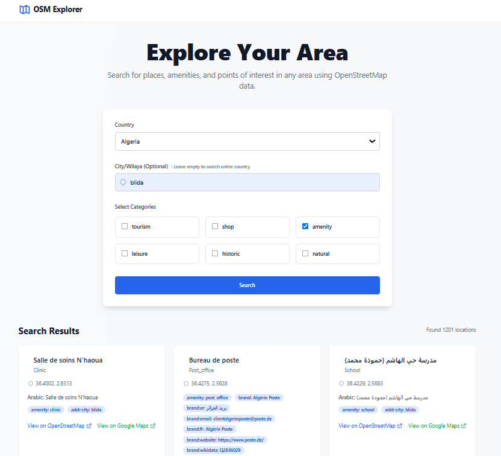

<div align="center">

```
 ██████╗ ███████╗███╗   ███╗
██╔═══██╗██╔════╝████╗ ████║
██║   ██║███████╗██╔████╔██║
██║   ██║╚════██║██║╚██╔╝██║
╚██████╔╝███████║██║ ╚═╝ ██║
 ╚═════╝ ╚══════╝╚═╝     ╚═╝
███████╗██╗  ██╗██████╗ ██╗      ██████╗ ██████╗ ███████╗██████╗ 
██╔════╝╚██╗██╔╝██╔══██╗██║     ██╔═══██╗██╔══██╗██╔════╝██╔══██╗
█████╗   ╚███╔╝ ██████╔╝██║     ██║   ██║██████╔╝█████╗  ██████╔╝
██╔══╝   ██╔██╗ ██╔═══╝ ██║     ██║   ██║██╔══██╗██╔══╝  ██╔══██╗
███████╗██╔╝ ██╗██║     ███████╗╚██████╔╝██║  ██║███████╗██║  ██║
╚══════╝╚═╝  ╚═╝╚═╝     ╚══════╝ ╚═════╝ ╚═╝  ╚═╝╚══════╝╚═╝  ╚═╝
```

<h1>🗺️ OpenStreetMap Explorer</h1>
<p>A powerful OpenStreetMap data exploration tool with intelligent filtering and seamless search capabilities.</p>

 [](https://opensource.org/licenses/MIT)
 [](https://nodejs.org/)
 [](https://www.openstreetmap.org/)
 [](https://github.com/opestro/OSM-Explorer)
</div>

## 🌟 Features
- **🔍 Smart Search**: Advanced filtering and intelligent search algorithms for precise location discovery
- **🌍 Multi-Region Support**: Search across countries, cities, and specific areas with ease
- **🏷️ Category Filtering**: Filter locations by multiple categories (tourism, shops, amenities, etc.)
- **🌐 Multi-Language**: Support for multiple languages including English, French, and Arabic
- **📍 Detailed Information**: Rich location details including coordinates, tags, and alternative names
- **🔗 Direct Links**: Quick access to locations on both OpenStreetMap and Google Maps
- **⚡ Real-Time Results**: Fast and efficient data retrieval using Overpass API
- **📱 Responsive Design**: Beautiful, mobile-friendly interface built with TailwindCSS

## 🚀 Why OSM Explorer?
OSM Explorer offers several advantages over direct OpenStreetMap usage or raw Overpass queries:
- **🎯 Simplified Search**: No need to learn complex Overpass QL syntax
- **🔄 Smart Filtering**: Intelligent result filtering based on relevance and completeness
- **📊 Better Organization**: Structured display of results with important information highlighted
- **🎨 Modern Interface**: Clean, intuitive UI that makes exploration enjoyable
- **🔍 Area-Based Search**: Easy to search within specific administrative boundaries
- **⚙️ Optimized Queries**: Efficiently structured queries to reduce server load and improve response times
## 📸 Showcase

<div align="center">

### 🌟 Modern Interface


</div>

## 🛠️ Technology Stack
- **Backend**: Node.js, Express
- **Frontend**: Alpine.js, TailwindCSS
- **Data**: OpenStreetMap, Overpass API, Nominatim
- **Enhanced**: AI-powered development for optimal performance

## 🚀 Getting Started
1. Clone the repository:
```bash
git clone https://github.com/opestro/OSM-Explorer.git
```
2. Install dependencies:
```bash
npm install
```
3. Create a `.env` file with required configurations
4. Start the server:
```bash
npm start
```

## 📖 API Documentation

### Search Endpoint
```
GET /search
```
Parameters:
- `country`: ISO 3166-1 country code
- `area`: (Optional) City/region name
- `tags`: Comma-separated list of OSM tags

### Countries Endpoint
```
GET /api/countries
```
Returns list of available countries with codes and languages.

## 👨‍💻 Developer

**Mehdi Harzallah**
- GitHub: [@opestro](https://github.com/opestro)
- LinkedIn: [Mehdi Harzallah](https://www.linkedin.com/in/mehdi-harzallah)

## 🤝 Contributing

Contributions, issues, and feature requests are welcome! Feel free to check the [issues page](https://github.com/opestro/OSM-Explorer/issues).

## 📝 License

This project is [MIT](https://opensource.org/licenses/MIT) licensed.

## 🙏 Acknowledgments

- OpenStreetMap Contributors
- Overpass API Team
- The Open Source Community

---

<div align="center">
  <sub>Built with ❤️ by <a href="https://github.com/opestro">Mehdi Harzallah</a></sub>
</div>

